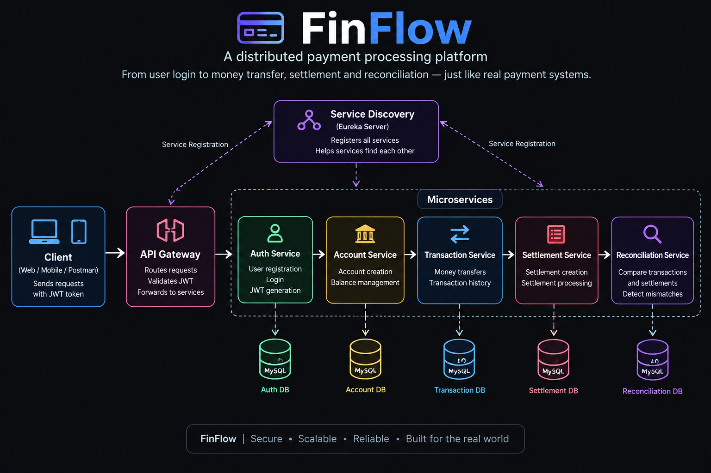

# 💳 FinFlow

> A production-inspired payment processing system built with Java 21, Spring Boot and Microservices.



## 📌 About

FinFlow simulates a real-world payment system where users can:

- Register and login
- Create and manage accounts
- Transfer money
- Track transactions
- Process settlements
- Reconcile transactions and settlements

## 🏗️ Architecture

- **Auth Service** – Registration, login & JWT
- **Account Service** – Account & balance management
- **Transaction Service** – Money transfers
- **Settlement Service** – Settlement processing
- **Reconciliation Service** – Transaction verification
- **API Gateway** – Request routing & JWT validation
- **Eureka Server** – Service discovery

### Payment Flow

```text
Client
   ↓
API Gateway
   ↓
Transaction Service
   ↓
Account Service
   ↓
Settlement Service
   ↓
Reconciliation Service
📂 Project Structure
FinFlow - microservices/
│
├── AuthService/
│   └── AuthService/
│
├── account-service/
│   └── account-service/
│
├── apigateway/
│   └── apigateway/
│
├── discovery-server/
│   └── discovery-server/
│
├── transaction-services/
│   └── transaction-services/
│
├── settlement-service/
│   └── settlement-service/
│
├── reconciliation-service/
│   └── reconciliation-service/
│
├── docs/
│   └── architecture/
│       └── finflow-system-architecture.png
│
├── .gitignore
└── README.md
🛠️ Tech Stack

Java 21 • Spring Boot • Spring Security • JWT • MySQL • JPA/Hibernate • Eureka • Spring Cloud Gateway • OpenFeign • RestClient • Maven • Postman

🚀 Run Locally

Create the database:

CREATE DATABASE finflow;

Configure MySQL credentials in the application.properties files.

Start Eureka Server first, followed by the other services.

API Gateway:

http://localhost:8080

APIs can be tested using Postman.

✅ Current Status
JWT Authentication & Authorization
Account Management
Money Transfer
Settlement Processing
Reconciliation
Microservice Communication
API Gateway
Eureka Service Discovery
🔮 Future

Kafka • Docker • Swagger • Resilience4j • Fraud Detection • Kubernetes

👩‍💻 Author

Mayuri Pawar
B.E. Electronics & Computer Engineering
```
